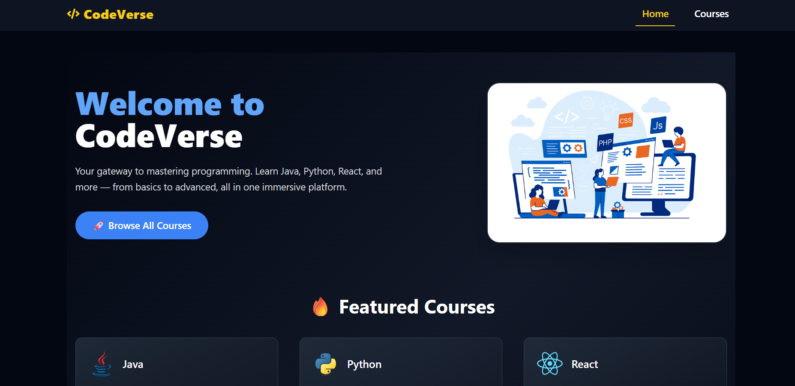
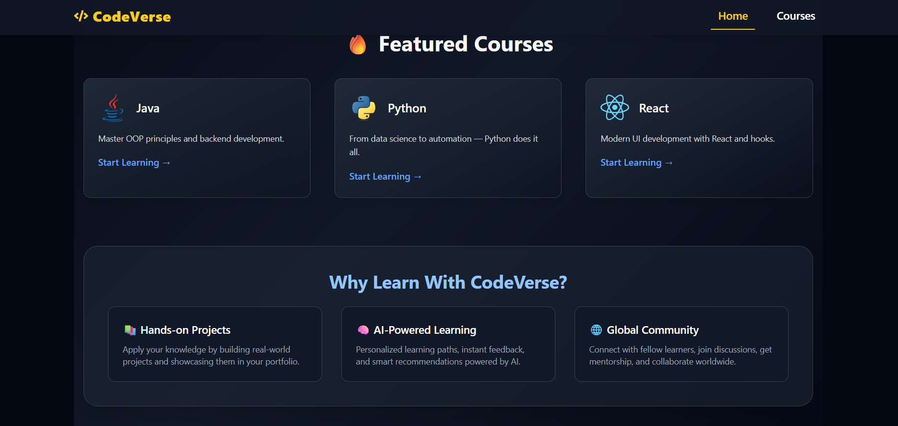
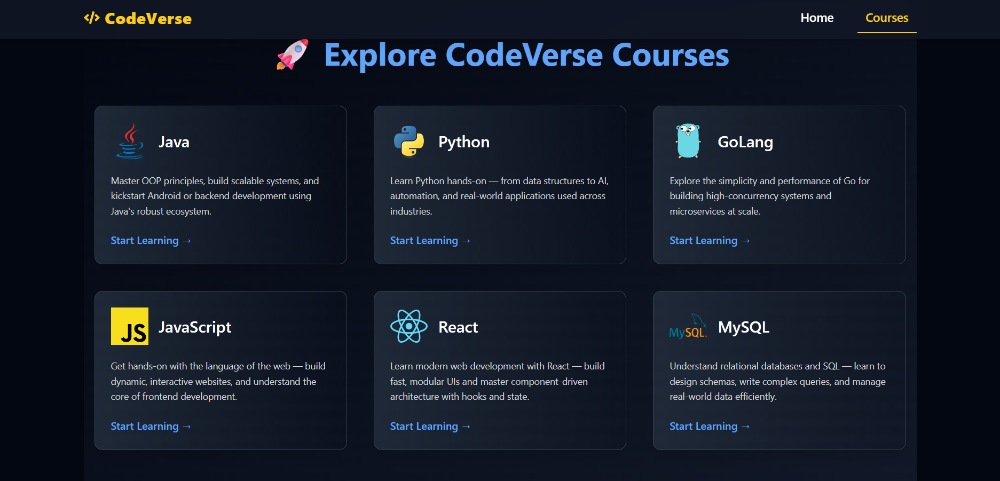
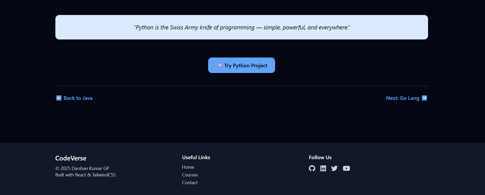
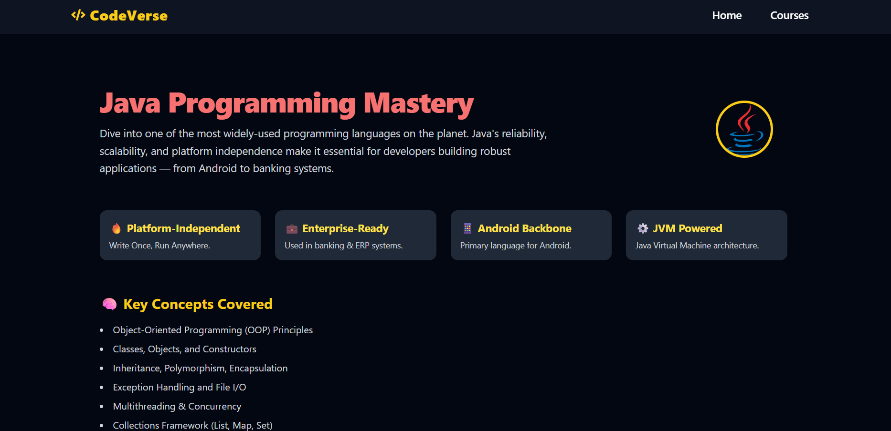

# 🚀 CodeVerse


**CodeVerse** is a modern, fully responsive, and beginner-friendly e-learning platform built with **ReactJS**. It features beautifully designed course pages, a landing page, and a section for trending technologies like **Python**, **Java**, and **React** — all tailored for learners of all levels.

---

## 🧠 Features

- 🏠 **Landing Page** with elegant layout and smooth transitions
- 🚀 **Featured Courses** section highlighting trending tech skills
- 📘 Dedicated course pages: **Python**, **Java**, and **React**
- 📱 Mobile-first responsive design with **TailwindCSS**
- 🔀 Navigation using **React Router DOM**
- 🌙 Clean, consistent UI with reusable components

---

## 📸 Screenshots

### 🔹 Home Page  


### 🔹 Featured Courses  


### 🔹 All Courses Page  


### 🔹 Python Course  


### 🔹 Java Course  


### 🔹 React Course  


---

## 🛠️ Tech Stack

| Category     | Tools / Libraries         |
|--------------|----------------------------|
| Frontend     | ReactJS                    |
| Styling      | TailwindCSS                |
| Icons        | React Icons                |
| Routing      | React Router DOM           |
| Tooling      | Vite                       |

---

## 🗂️ Folder Structure

```bash
CodeVerse/
├── public/
├── src/
│   ├── assets/              # All image assets
│   ├── components/          # Reusable components (e.g., Navbar, Footer)
│   ├── pages/               # Individual course pages (Python, Java, React)
│   ├── App.jsx              # Main application component
│   ├── main.jsx             # App entry point
│   └── index.css            # Tailwind base styles
├── package.json
└── README.md

🚀 Getting Started
Follow these steps to run the project locally:

1. 📦 Clone the Repository
git clone https://github.com/DarshankumarGP/CodeVerse.git
cd CodeVerse

2. 📥 Install Dependencies
npm install

3. ▶️ Start Development Server
npm run dev
Then open http://localhost:5173 in your browser to view the app.

🙌 Contributing
Pull requests are welcome! For major changes, please open an issue first to discuss what you’d like to change.
Don't forget to ⭐ the repo if you like it!

📄 License
This project is licensed under the MIT License – see the LICENSE file for details.

👨‍💻 Developed By
Darshan Kumar GP
“Learning through building.”


🧩 Acknowledgements
ReactJS documentation – reactjs.org

TailwindCSS documentation – tailwindcss.com

React Icons – react-icons.github.io